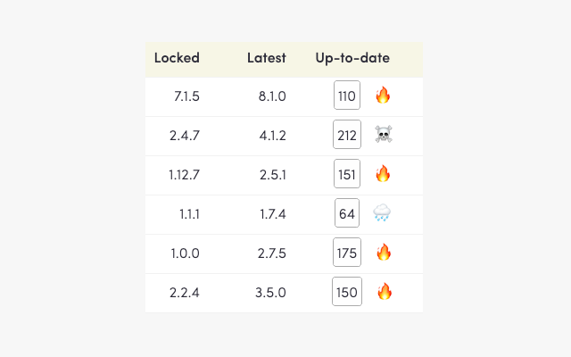
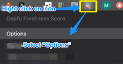
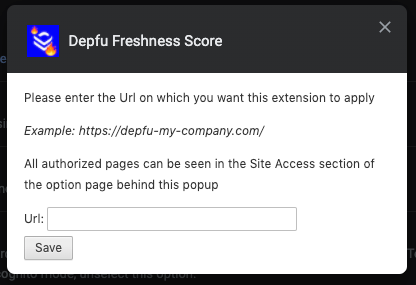
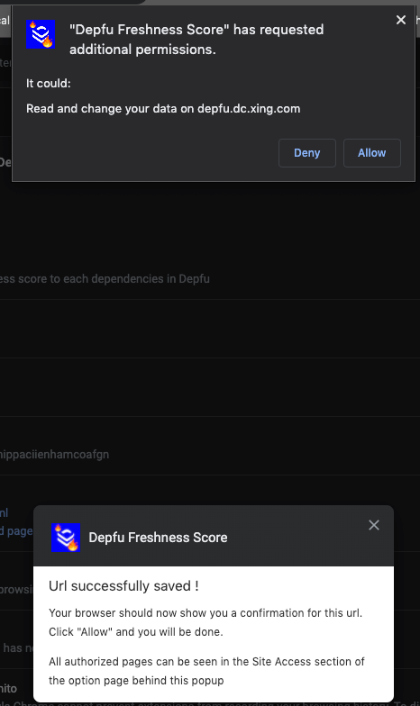
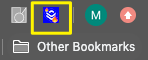

# Depfu Freshness Scores and Icons

If you are using Depfu to manage and update your repos' external dependencies, the script/extension will help you spot immediately which need your attention.

> Some of my dependencies are litteraly on fire !  
> _A first time user_

Using the data from the depfu dashboard, this script calculates and displays how "fresh" is the version of each dependency compared to the latest version available on Github.

The lowest the freshness score is, the better.



The maths are simple. Let's take an example:

```
Locked: 1.1.5
Latest: 2.3.2
```

We go from left to right

One major version behind: `1*100` to round to the next major version  
`1.1.5 --> 2.0.0 // Score increases by 100`

Three minor versions behind: `3*10` to move 3 next minor versions forward  
`2.0.0 --> 2.3.0 // Score increases by 3*10 == 30`

Two patch versions behind: `2*1` to move 2 patch versions forward  
`2.3.0 --> 2.3.2 // Score increases by 2*1 == 2`

Total freshness score: `100 + 30 + 2 == 132`  
Icon: 🔥  
_Time to upgrade urgently this dependency !_

---

# Getting Started

This script is available as an Chrome extension or as a userscript.

## Chrome extension

1. Download the extension from the Chrome Web Store:  
   https://chrome.google.com/webstore/search/depfu%20freshness?authuser=0&hl=en-GB

2. Go in the Options page for the extension.  
   The easiest way to get there is to right click on the extension icon, when it appears.

   

3. Add your Depfu domain in the input box and follow the instructions
   

   

4. Refresh your Defu page and the icon should appear in color

   

---

## Userscript

**Userscripts** work exactly like browser extensions - but they give developers more freedom to tweak and play with the source code. They don't have custom icons, or access to some native browsers methods, but are less hassle to develop.

Functionally, the Depfu-Freshness-Score extension and userscript are doing the same.

### Prerequisite

The application is has been tested/styled on the latest version of Chrome and **Firefox**.

In order for your browser to run userscripts, you need to install a userscript manager extension. I recommand **Tampermonkey**

1. Install the [Tampermonkey extension](https://chrome.google.com/webstore/detail/tampermonkey/dhdgffkkebhmkfjojejmpbldmpobfkfo)

2. Install the Depfu-Freshness-Score script in tampermonkey

   Go to this url: [https://github.com/matthizou/depfu-freshness-score-extension/raw/master/depfu-freshness-score.user.js](https://github.com/matthizou/depfu-freshness-score-extension/raw/master/userscript/userscript.user.js)

   Tampermonkey will pick up the fact that you are displaying a raw userscript and will ask you if you want to install the script.

   Click the **install** button.

   

## Authors

- **Matthieu Izoulet**
